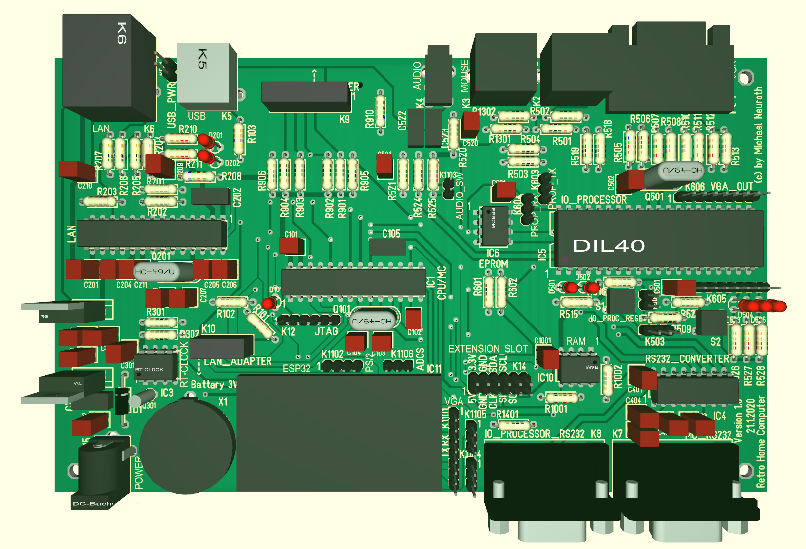

# PicoHomeComputer

The PicoHomeComputer project is intended to make it possible to build a simple but fully functional (home) computer completely by yourself.
The project is also intended as teaching project to show what hardware and software is needed to build a computer from scratch.

With the documentation in this project it is possible to use the board, buy the needed electronic parts and then mount and solder 
the electronic parts on the board.
After that one can install the software/firmware and connect periphery like keyboard, mouse and monitor to the board and
run and use the computer. The PicoHomeComputer has all the functionality of a home computer from the 80ies and even a litle bit more, 
for example the computer can be connected via LAN to the internet.

Technical specifications
------------------------

- Processor: PIC32 microcontroller (MIPS based, [PIC32MX270F256B](https://www.microchip.com/wwwproducts/en/PIC32MX270F256B)), optional: [ESP32 from espressif](http://esp32.net/)  
  - CPU clock speed: 48 MHz
  - RAM: 64 kByte
  - ROM: 256 kByte
- (S)RAM: 1 MBit = 128 kByte via SPI Bus (23LC1024)
- SD card interface via SPI Bus
- LAN interface via SPI Bus (ENC28J60)
- Real Time Clock via I2C Bus (DS1307)
- IO Processor (Propeller [P8X32A](https://www.parallax.com/product/p8x32a-d40) from Parallax)
  - VGA output
  - Keyboard
  - Mouse
  - Audio 

  
Conections for periphery
------------------------

- VGA monitor interface
- PS/2 for keyboard
- PS/2 for mouse
- Audio interface
- USB 2.0 interface
- SD card interface  
- 10 MBit LAN interface
- 2x RS232 interface
- Extension slot with voltages, I2C Bus and SPI Bus
- Powersupply interface (for a 7-12 Volt power supply) 

Parts
-----

- [Board](https://github.com/mneuroth/PicoHomeComputer/tree/master/board)
- [Documentation](https://github.com/mneuroth/PicoHomeComputer/tree/master/Documentation)
- [Setup and Operation of the Board](https://github.com/mneuroth/PicoHomeComputer/tree/master/Setup)
- [Setup ArduinoIDE for PicoHomeComputer](https://github.com/mneuroth/PicoHomeComputer/tree/master/chipKIT_patches)
- Software for the PicoHomeComputer
  - [chipKIT](https://chipkit.net/), this is the PIC32 platform support for the [Arduiono IDE](https://www.arduino.cc/en/Main/Software)
  - [chipKIT patches for the PicoHomeComputer](https://github.com/mneuroth/PicoHomeComputer/tree/master/chipKIT_patches)
  - [uLisp for chipKIT](https://github.com/mneuroth/ulisp-pic32-chipKIT), the [uLisp](http://www.ulisp.com/) (a lisp for microcontrollers) for the PIC32 microcontroller (only communication via RS232 interface possible)
  - [uLisp for PicoHomeComputer](https://github.com/mneuroth/PicoHomeComputer-ulisp), the [uLisp](http://www.ulisp.com/) (a lisp for microcontrollers) for the PicoHomeComputer (using the Propeller IO Processer for full IO support with Keyboard, Mouse and VGA)
  - [Bootloader for the PicoHomeComputer](https://github.com/mneuroth/PicoHomeComputer-pic32-bootloader)
  - [Library for ENC28J60 for chipKIT/PicoHomeComputer](https://github.com/mneuroth/PicoHomeComputer-EtherCard)
  - [Libraries for Propeller](https://github.com/parallaxinc/propeller)
- Other Software
  - [Library for SRAM 23LC1024 via SPI bus](https://github.com/dndubins/SRAMsimple)
  - [Library for SD Card via SPI bus](https://github.com/adafruit/SD)  
- Supported Hardware Modules
  - [ENC23J60 adapter](https://eckstein-shop.de/ENC28J60-Ethernet-LAN-Netzwerk-Modul)
  - [SD Card adapter](https://eckstein-shop.de/SD-Memory-Card-Module-Slot-SPI-Reader)
- [Datasheets](https://github.com/mneuroth/PicoHomeComputer/tree/master/datasheets)

# Some useful informations about microcontrollers

Interpreters for microcontrollers
---------------------------------

- [uLisp](http://www.ulisp.com/)
- [ESP lisp](https://github.com/yesco/esp-lisp)
- [MicroPython](https://micropython.org/) on [github](https://github.com/micropython/micropython), see also [Python for PIC32](https://stonepile.fi/micropython-pic32/)
- [Lua](http://www.eluaproject.net/)
- [MMBasic](http://mmbasic.com/)
- [AVR Basic](https://www.mikrocontroller.net/articles/AVR_BASIC)
- [my_basic](https://github.com/paladin-t/my_basic)
- [Overview of interpreters on stackexchange](https://electronics.stackexchange.com/questions/3423/survey-of-high-level-language-interpreters-compilers-for-microcontrollers)
- [Overview of interpreters on stackoverview](https://stackoverflow.com/questions/1082751/what-are-the-available-interactive-languages-that-run-in-tiny-memory)
- [Single-File Implementations of Programming Languages](https://github.com/marcpaq/b1fipl)

Operating systems for microcontrollers
--------------------------------------

- [RetroBSD](https://github.com/RetroBSD/retrobsd)
- [FreeRTOS](https://www.freertos.org/)
- [RIOT-OS](https://github.com/RIOT-OS/RIOT)
- [picoOS](http://picoos.sourceforge.net/)
 
  
Other intresting computer projects
----------------------------------  

- [Maximite](http://geoffg.net/maximite.html)
- [HIVE-Project](https://hive-project.de/)
- [RetroBrew Computers Wiki ](https://www.retrobrewcomputers.org/doku.php)
- [Retro PIC single board computer](https://www.nutsvolts.com/magazine/article/January2017_Retro-PIC-Single-Board-Computer)
- [HelvePIC32](https://www.helvepic32.org/)

Other intresting microcontroller platforms
------------------------------------------

- [Teensy (ARM)](https://www.pjrc.com/teensy/)
- [MINI-32 Board (PIC32)](https://www.mikroe.com/mini/)
- [STM32F4 Core Board](https://www.waveshare.com/product/mcu-tools/stm32/core407i.htm)
- [ARM in DIP housing](https://www.mikrocontroller.net/topic/439180)

Interesting portals for microcontrollers projects
-------------------------------------------------

- [mikrocontroller.net](https://www.mikrocontroller.net/)
- [PC USB Projects](https://sites.google.com/site/pcusbprojects/home-1)
