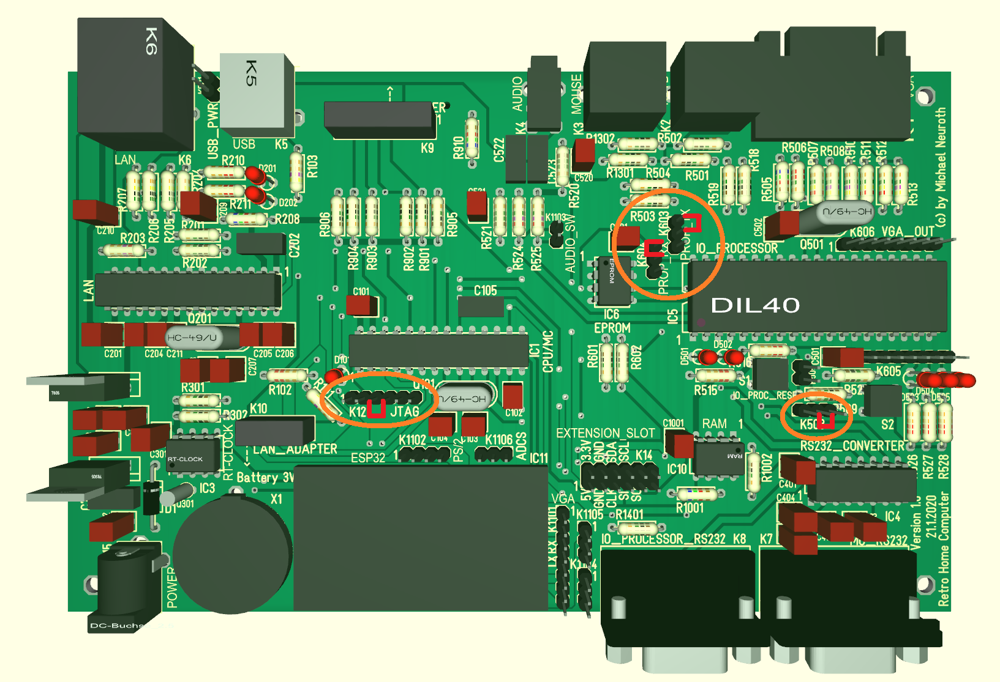
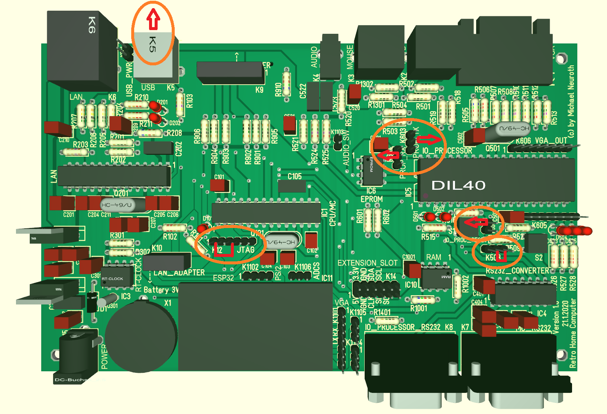

# Setup and Operation of the PicoHomeComputer

Initial firmware setup
----------------------

- Configure the board for the programming operation mode (see below).
- Install the [Arduino IDE](https://www.arduino.cc/en/software), install the [chipKIT support for the Arduino IDE](https://github.com/mneuroth/PicoHomeComputer/tree/master/chipKIT_patches) and install the [Propeller IDE](https://developer.parallax.com/propelleride/).
- Flash the (Arduino compatible) [PicoHomeComputer bootloader](https://github.com/mneuroth/PicoHomeComputer-pic32-bootloader/tree/master/firmware/bootloaders-hex) for the PIC32 MCU (IC1), so that the firmware of the MCU can be updated with the Arduino IDE via the USB RS232 connection. Use the JTAG connector K12 to connect a [PICKit 3 programmer](https://www.microchip.com/DevelopmentTools/ProductDetails/PG164130#utm_source=MicroSolutions&utm_medium=Link&utm_term=FY17Q1&utm_content=DevTools&utm_campaign=Article) for initial firmware flashing.
- optional: Open the source code of the [uLisp implementation for the chipKIT platform](https://github.com/mneuroth/ulisp-pic32-chipKIT) inside the Arduino IDE and upload this firmware for testing. Communication is possible via the RS232 connection on connector K7 (MC_RS232). Attention: a null-modem is needed to connect the PicoHomeComputer to a Host-PC.
- Open the source code of the [uLisp implementation for the PicoHomeComputer](https://github.com/mneuroth/PicoHomeComputer-ulisp) inside the Arduino IDE and upload this firmware the the normal operation mode.
- Open the source code of the [IO Processor (IC5) firmware](https://github.com/mneuroth/PicoHomeComputer/tree/master/Propeller/Firmware) inside the [Propeller IDE](https://developer.parallax.com/propelleride/) and upload this firmware to the Propeller chip via the connected [FTDI232 USB RS232 adapter](https://www.az-delivery.de/products/ftdi-adapter-ft232rl).

Normal operation mode
---------------------

- Disable the programming mode of the boot loader for the MCU (IC1) by connecing Pin 3 and Pin 4 of pin bar K15 (Jumper may be removed after booting of the PicoHomeCompuer to enable support for ETHERNET_NOT_INTERRUPT line).
- Connect serial communication between IO Processor and MCU (IC1) by connecting Pin 1 and Pin 2 of pin bars K603 and K604.
- Set BOEn to GND for the IO Processor (IC5) by connecting Pin 1 and Pin 2 of pin bar K503.

Programming operation mode
--------------------------

- For initial flashing of the (Arduino compatible) bootloader connect a programmer to the JTAG connector K12.
- Enable the programming modus of the boot loader for the MCU (IC1) by connecing Pin 2 and Pin 4 of pin bar K15. The fast blinking LED D101 near the JTAG connector indicates the programming mode.
- Connect USB on K5 to Host Computer to flash the MCU (IC1) with Arduino Studio

- Set BOEn to GND for the IO Processor (IC5) by connecting Pin 1 and Pin 2 of pin bar K503.
- Connect USB RS232 Adapter FTDI232 to serial port of IO PRocessor (IC5) on of Pin 2 of pin bar K603 (TX) and Pin 2 of pin bar K604 (RX) and Pin 2 (RESn) of pin bar K505 (DTR).
- Connect USB RS232 Adapter FTDI232 to Host Computer to flash the IO Processor (IC5) with Propeller IDE.

